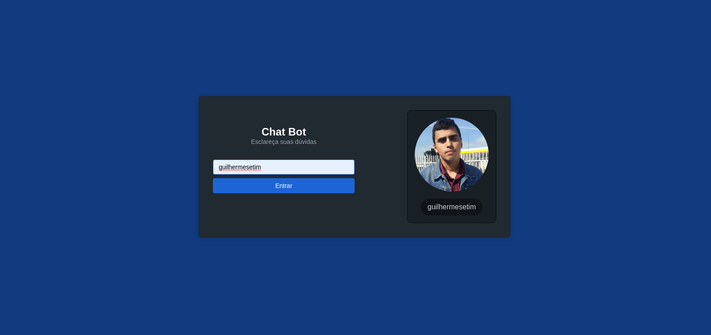
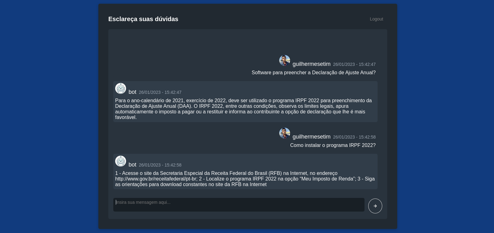

# Front-End de um ChatBot

Link do *front-end* projeto: https://

 

O link destina-se a apresentação do *front-end* da aplicação é necessário executar um servidor com o ChatBot instalado.


# Sobre o projeto
Trata-se de um projeto de ChatBot simples, em formato de aplicação *Web*, para testar o treinamento de um ChatBot.

A usabilidade consiste em informar usuário do GitHub para apresentar foto e o nome do usuário na interação com o ChatBot, as informações são consumidada por meio da API do GitHub, não é necessário autentificação da conta. A conversa inicia com uma mensagem do usuário, em que é realizada uma requisição assíncrona ao servidor do ChatBot, pelo método POST, e retorna uma JSON com a mensagem processada pelo ChatBot.

Esse repositório destina-se ao *front-end* da aplicação, o ChatBot deve ser executado juntamente com nesse repositório: https://

## Tecnologias utilizadas para o Front-End
- JavaScript;
- React Js;
- Next Js;


### Biblioteca externa
- SkyNexUI;
A biblioteca de criação componentes pode ser encontrada em: https://skynexui.dev/ ou https://github.com/skynexui/components,

## Como executar o projeto localmente
### Gerenciador de pacotes utilizado
- yarn;

### Requisitos
- Node JS;
- React;
- Next JS;
- SkyNexUI;

Para renderizar a página, execute o comando no diretório do projeto:
```
yarn dev
```

Por padrão, o React executa na porta 3000, caso a porta esteja ocupada, será indicado no terminal.

### Como adequar ao seu projeto de ChatBot
No arquivo config.json é destinado a configuração de cada projeto, nos quais destaco:
- "titulo": Texto do título da página de *login*;
- "subtitulo": Texto do subtítulo da página de *login* e do *header* do *chat*;
- "servidor": Destinado a URL da API que enviará a mensagem do usuário e receberá o texto processado do ChatBot, se utilizar um servidor local Flask, por padrão o Flask utiliza a porta 5000;

Também é necessário, retirar o comentário da função requisicaoServidor() [linhas 134-166], e comentar ou retirar a função novaMensagem()[linhas 133-165].
